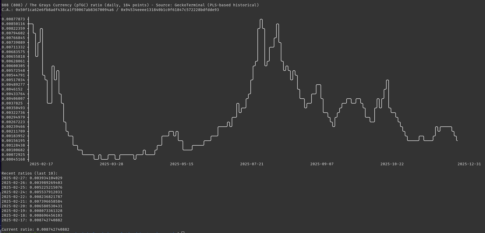

# PulseChain Token Ratio Chart

A powerful Node.js tool to visualize the price ratio of **any two PulseChain tokens** (Token A / Token B) in a beautiful, aligned ASCII chart — even when no direct liquidity pool exists between them.

Uses **GeckoTerminal** (free, no API key) for deep historical data and intelligent pool selection. Falls back to **DexTools** current prices if needed.

IMPORTANT: Use at your own risk as defined in the included file, `../LICENSE`.

For details, see the file header doc in `pulse-token-ratio.js`.

## Features

- **Smart pool selection** – automatically chooses the pool with the deepest history when the highest-liquidity pool is new/shallow.
- **Human-readable output** – shows token names/symbols and contract addresses clearly.
- **Proper scaling** – y-axis uses actual data min/max with unique, clean tick values.
- **Aligned x-axis** – sparse date (or date+hour) labels perfectly lined up under the chart.
- **Supports hourly, daily, weekly** intervals.
- **CSV export** option for further analysis.
- **Graceful DexTools fallback** – warns if no API key is set, but works fully without one.

## Pre-requisites

NodeJs (package name `nodejs`) version 18 or above.

## Installation

```bash
git clone https://github.com/nottoseethesun/pulsechain-analytics.git
cd chart-price-ratio
npm install
```

## Configuration

Edit `config.json` to set defaults:

```json
{
  "network": "pulsechain",
  "chain": "pulse",
  "dextools": {
    "apiKey": "YOUR_API_KEY_HERE",
    "subscription": "standard",
    "host": "<https://public-api.dextools.io>",
    "version": "v2"
  },
  "csvFilename": "token_ratio.csv",
  "interval": "weekly",
  "maxCandles": 1000,
  "weeklyResampleDays": 7
}
```

*Tip: Add your DexTools API key to enable current-price fallback if GeckoTerminal data is unavailable.*

## Usage

### Basic: weekly ratio (default)

`node pulse-token-ratio.js <tokenA> <tokenB>`

### Example with $808 and $pTGC

`node pulse-token-ratio.js 0x50f1ca62e6fb8adf438ca1f50067ab83670094a6 0x94534eeee131840b1c0f61847c572228bdfdde93`

### Specify Interval

```bash
node pulse-token-ratio.js <tokenA> <tokenB> --interval=daily
node pulse-token-ratio.js <tokenA> <tokenB> --interval=hourly
```

### Export to CSV

`node pulse-token-ratio.js <tokenA> <tokenB> --interval=weekly --csv`

### One-time DexTools key override

`node pulse-token-ratio.js <tokenA> <tokenB> --api-key=your_key_here`

## Output Example

Here's $808 / $pTGC on PulseChain!



*Daily ratio chart for $808 / $pTGC showing perfect alignment, unique y-ticks, and smooth line rendering*

## Contributing

See the info on Contributing at `../README.md`.
